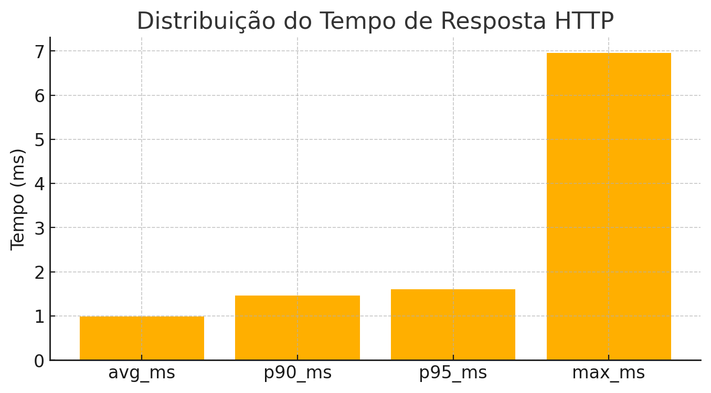
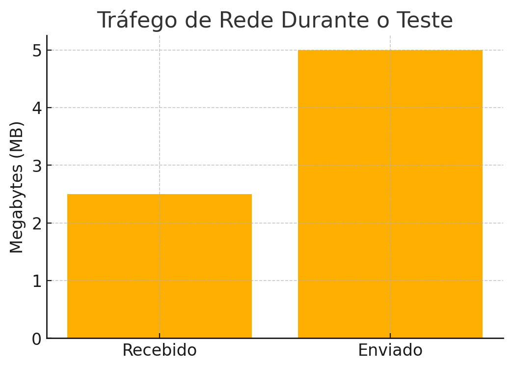
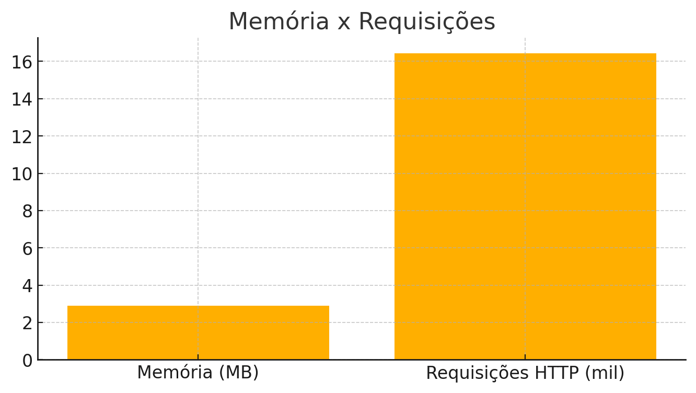

# 📊 K6 Load Test Report

Este relatório apresenta os principais insights coletados durante um teste de carga executado com [k6](https://k6.io).

## ⚡ Resumo do Teste

- ⏱ Duração: **4 minutos e 30 segundos**
- 🔄 Requisições HTTP: **16.444**
- 🚀 VUs Máximos: **100**
- 📉 Taxa de erro: **0%**
- 💾 Memória usada: **~2.91 MB**
- 🌐 Tráfego de rede: **5MB enviados, 2.5MB recebidos**

---

## 📈 Distribuição dos Tempos de Resposta

---

## 🌐 Tráfego de Rede Durante o Teste

---

## 🧠 Memória x Requisições

---

